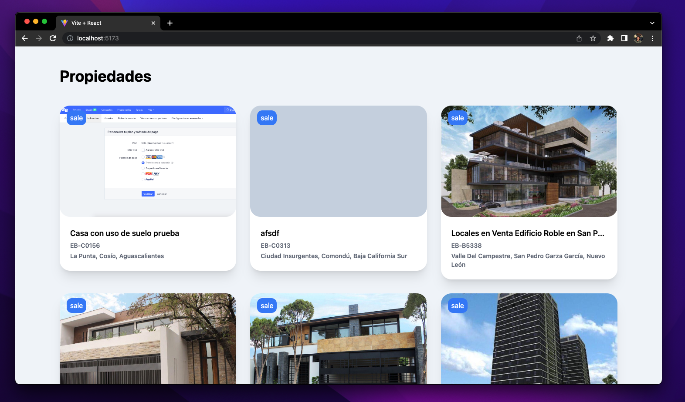
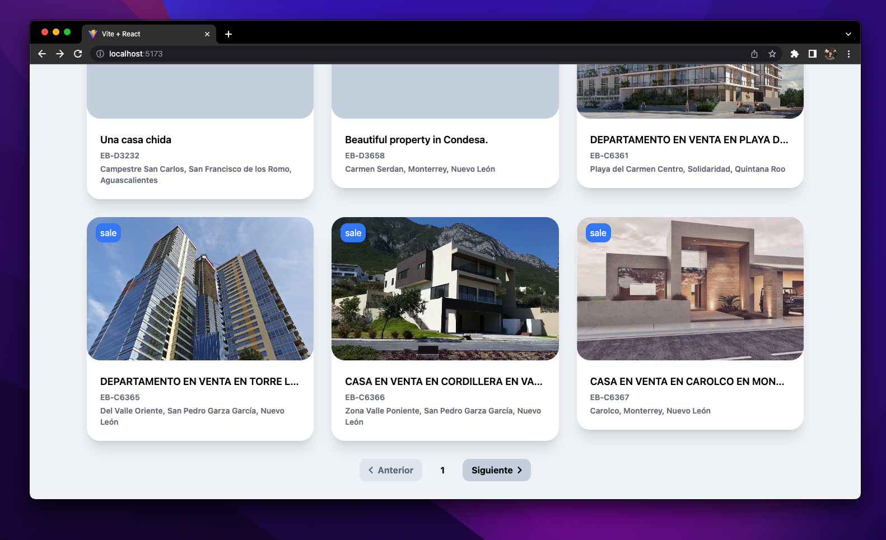
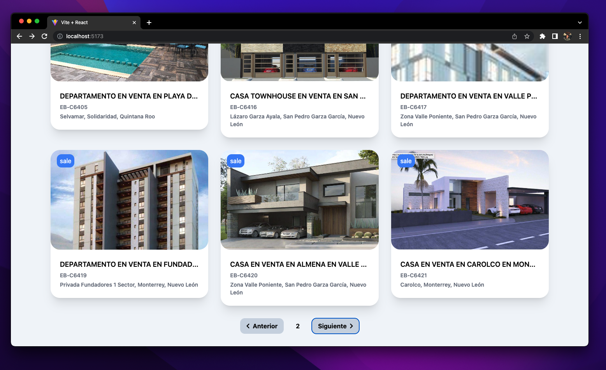
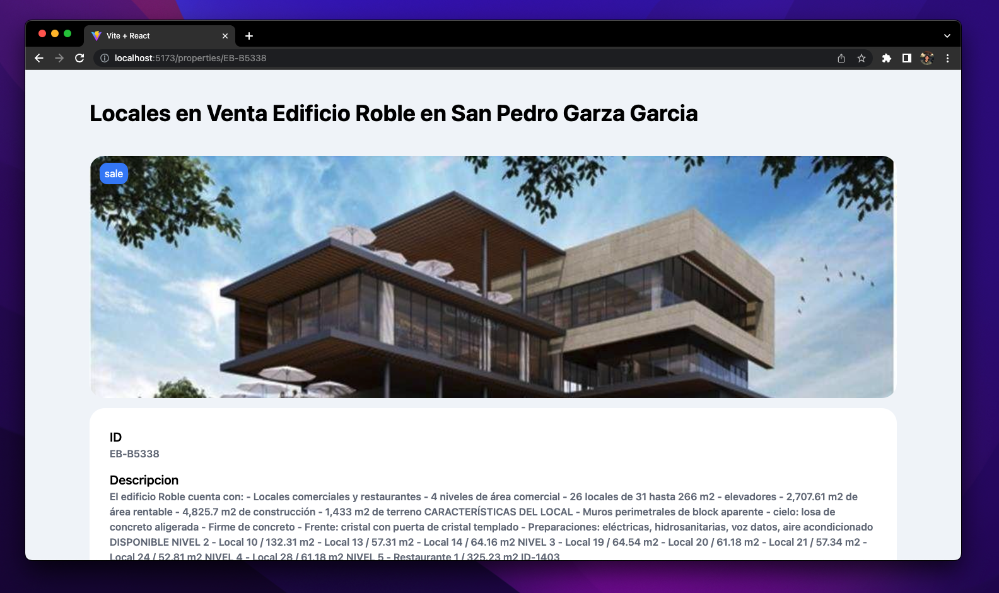
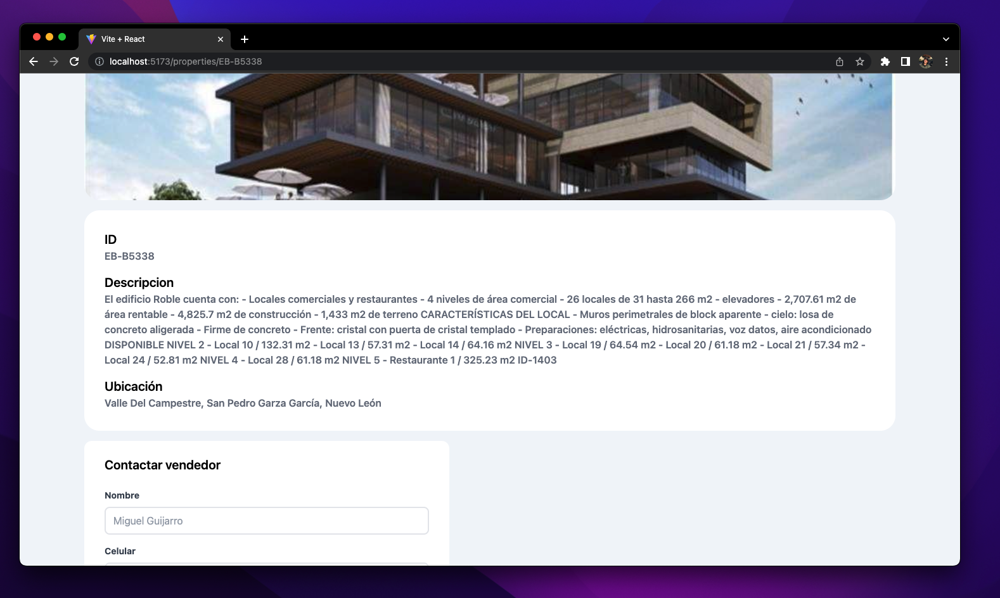
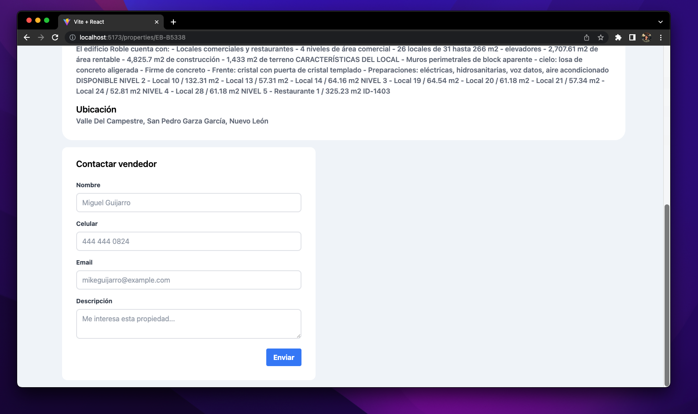

# EasyBroker Intern Project - Frontend
This is a WebApp developed with React (Vite).

<h2 align="center">
  
 
    
  

  
   
</h2>

## General Information 💡
Use `npm install` to install all dependencies.

Use `npm run dev` to run this project.

## Pics 🌅

  
 
    
  

  
Properties - Index or /properties endpoints show the same page

   
  
 
    
  

    
Pagination - Initial State

   
  
 
    
  

      
Pagination

   
  
 
    
  

      
Property

   
  
 
    
  

      
Property Info

   
   
 
    
  

      
Property - Contact Form

   

## Notes 🛠️
- **What was the hardest thing you had to solve while building the frontend?** Most of the heavy lifting part of these project was implemented on the backend, so I did not have any technical challenges on the frontend.
  
- **Are there any areas of your code that you think isn't that "clean"?** Yes... I think there are several oportunity areas in the component distribution of my frontend, I like to develop atomic components, and this webpage did not followed this particular aproach.
- **If you weren't able to finish: what were you able to complete and were you happy with your progress given the time constraints?** I was able to complete all the features and most of the objectives of this project. Unfortunately, the state management structure of this frontend is null. I am happy with the progress, however I would have liked to add unit test in my frontend (UI snapshots).  
- **Are extra credit features that aren't required but nice to have?** It would habe been nice to implement params state management in my urls. In that way, if I am in the page=5, I can share the url `url/properties?page=5...` and mantain the state of the app while sharing the url.